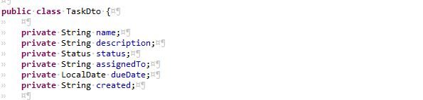
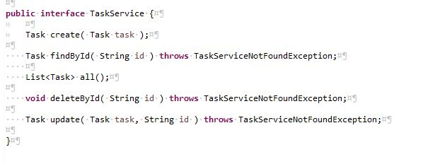
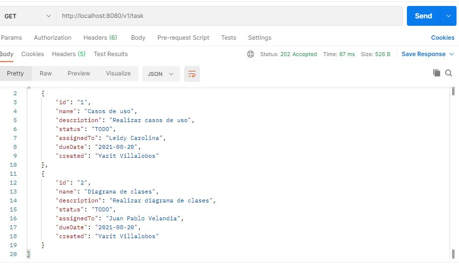
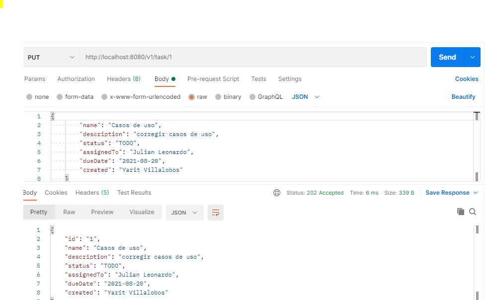
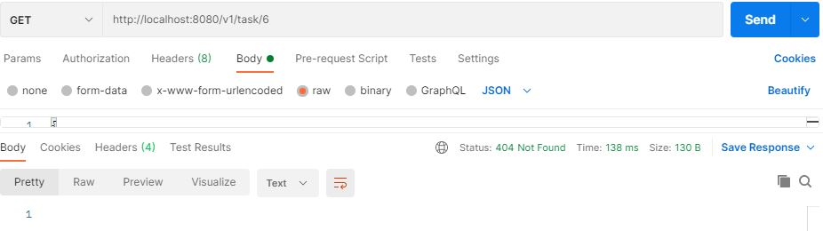

## Spring Boot Rest API

### Part 2: Implementing the Tasks Microservice RESTFUL API

1. Create a new project using the [Spring Initializr](https://start.spring.io/)
  * Use either *Java* or *Kotlin* as programming language.
  * Use Gradle as project option(if your computer is slow then use  Maven)
  * Add Spring Web dependency before generating the project.
2. Create a new repository on Github and commit the files generated in 1.
3. Create a new package called *dto* and inside define your *TaskDto* object with at least the following fields:
    * name.
    * description.
    * status [TODO, DOING, REVIEW and DONE].
    * assignedTo.
    * dueDate.
    * created.

4. Create a new package called *data* and inside define your *Task* data object with at least the following fields:
    * id.
    * name.
    * description.
    * status [TODO, DOING, REVIEW and DONE].
    * assignedTo.
    * dueDate.
    * created.

5. Create a new package called *service* an inside create the following interface:

6. Create an implementation of the TaskService using a HashMap data structure inside.
7. Make your service implementation *TaskServiceHashMap* injectable using the *@Service* annotation.

  
8. Implement you *TaskController* (try to avoid copy paste, use the User Microservice as reference but try doing it consciously).

9. Test ALL the endpoints of your API using PostMan or any other tool of your preference.

## Create()

               

### Control de errores

## all()

## update()

#### Control Errores updade()

## delete()

#### Control Errores delete() 

## findById()

#### Control Errores delete() 

# Punto 1 del laboratorio

https://github.com/julitom1/laboratorio1
>>>>>>> 43bc2d145f6bff0dbfe42ede40fc0567e6b6aca7

